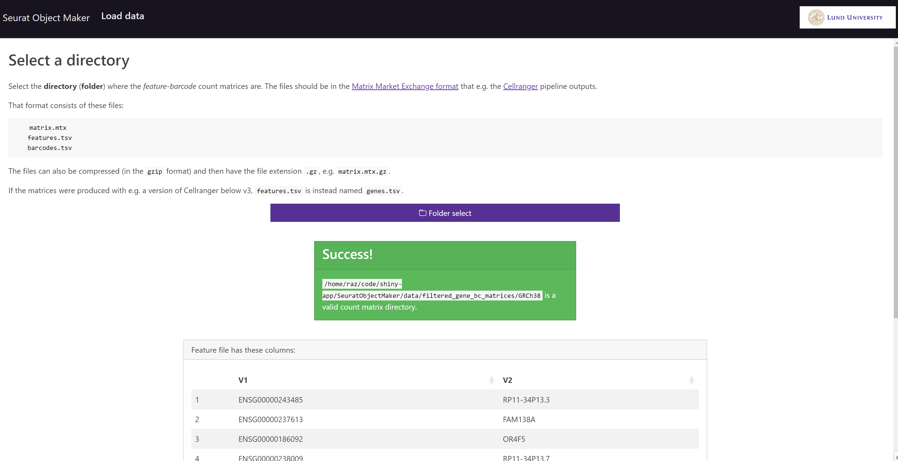
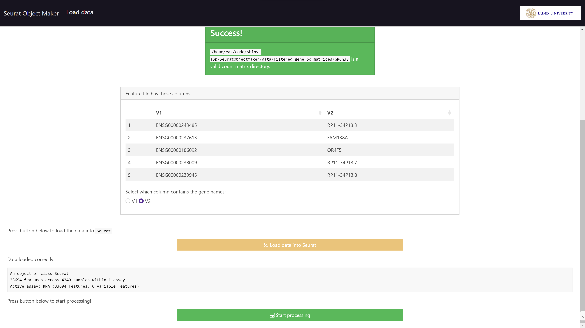

# Seurat Object Maker
## A Webapp For Turning A Count Matrix Directory Into A Seurat Object

A Shiny webapp for creating a Seurat object without programming expertise.
Load a count matrix directory, interactively filter on metadata, view results, download Seurat object and results of differential gene expression testing.

---

Currently hosted on Scilifelab Serve: [https://som.serve.scilifelab.se/app/som](https://som.serve.scilifelab.se/app/som).

### Installation

To install:

```R
devtools::install_github("razofz/SSOMaker", upgrade = "never")
```

After installation, to run it:

```R
SeuratObjectMaker::run_SOM(port = 3838)
```

and open `http://localhost:3838` in your browser.

If this is running on a server (i.e., the matrix files you want to load are not on the same computer as you're running this), adjust the line e.g. like this:

```R
SeuratObjectMaker::run_SOM(launch.browser = F, port = 32345, running_locally = F)
```

You can also run [this](https://hub.docker.com/r/razofz/seuratobjectmaker) Docker container: `razofz/seuratobjectmaker:0.0.2.2` (also port `3838`).

## Screenshots of current state

Selecting directory, with data validity checks:




Filtering page, setting thresholds with sliders. Violin plots and nbr cells left after filtering are updated in realtime.


The thresholds limits are updated in real-time, press "Confirm filtering thresholds" to continue:


Showing a loader while processing the data..


Results page:


More of results, differentially expressed genes per cluster (an accordion, can open for a cluster of interest at a time (to not swamp page if many clusters)):


Having pressed the "Download Seurat Object" button, the user is prompted to save the object as a `.rds` file (a filename including the date is suggested by default):


---

Note that "debugging" values are still printed etc, the webapp is not mature yet. Code structure is also "prototype-y". But the app is functional.
