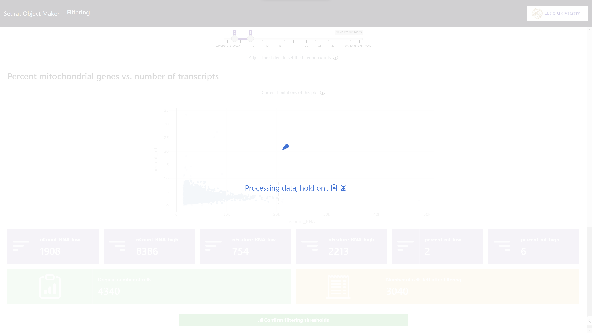
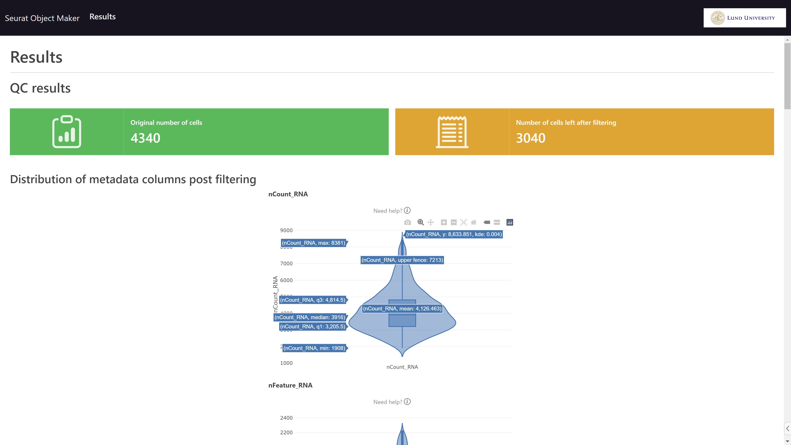

# Seurat Object Maker

## Screenshots of current state

Selecting directory, with data validity checks:

Filtering page, setting thresholds with sliders. Violin plots and nbr cells left after filtering are updated in realtime.

The thresholds limits are updated in real-time, press "Confirm filtering thresholds" to continue:

Showing a loader while processing the data..

Results page:

More of results, differentially expressed genes per cluster (an accordion, can open for a cluster of interest at a time (to not swamp page if many clusters)):

Having pressed the "Download Seurat Object" button, the user is prompted to save the object as a `.rds` file (a filename including the date is suggested by default):

---

Note that "debugging" values are still printed etc, the webapp is not mature yet. Code structure is also "prototype-y". But the app is functional.